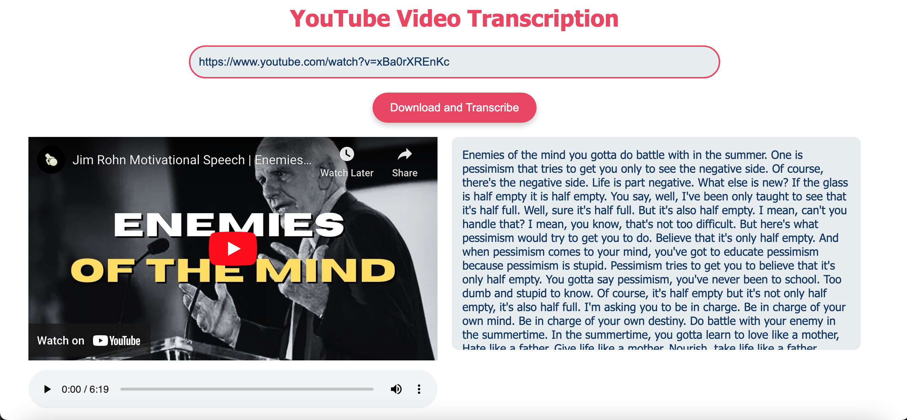

# Youtube Video Transcription App

## Overview

This project is a web application that allows users to download audio from YouTube videos, convert it to MP3 format, and generate a transcription of the audio using Deepgram's AI transcription service. The app features a simple and user-friendly interface, designed to make video transcription straightforward and efficient.

## Features
- YouTube Video to MP3 Conversion: Input a YouTube video URL, and the app will download and convert the audio to MP3 format.
- AI-Based Transcription: Transcribe the downloaded audio using Deepgram's advanced speech to text AI models.
- Responsive and Modern UI: A clean, modern interface that is responsive and easy to navigate.
- Error Handling: Displays error messages in a popup window for any issues that occur during processing.

## Demo



## Getting Started

### Prerequisites

- Python 3.x
- Flask
- youtube-dl
- Deepgram Python SDK

### Installation

Markup : 1. Clone the repository:
    ```console
    # Install the required packages
    git clone https://github.com/razaali90/youtube-transcription
    cd youtube-transcription
    ```
    2. Create a virtual environment and activate it:
    ```console
    python3 -m venv venv
    source venv/bin/activate  # On Windows use `venv\Scripts\activate`
    ```

    3. Install the required packages:
    ```console
    pip install -r requirements.txt
    ```

    4. Set up Deepgram API key:
    Obtain an API key from Deepgram.
    ```python
    DEEPGRAM_API_KEY = "YOUR_API_KEY"
    ```

## Running the Application

Markup : 1. Start the Flask app:
    ```console
    python3 app.py
    ```

    2. Access the application:
    Open your web browser and go to http://127.0.0.1:5000.

## Usage

- Enter a valid YouTube URL in the input field.
- Click the "Download and Transcribe" button.
- View the embedded video, listen to the downloaded audio, and read the transcription.

## Acknowledgements

- [Deepgram](https://deepgram.com/) for providing the AI transcription service.
- [YouTube-DL](https://github.com/ytdl-org/youtube-dl) for enabling video and audio downloads from YouTube.
- [Flask](https://flask.palletsprojects.com/en/3.0.x/) for the web framework.

## Author

- GitHub - [Raza Ali](https://github.com/razaali90)


